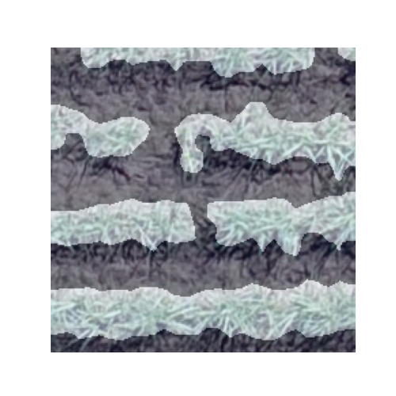

# BAGeo
Projeto para gerar máscaras de segmentação para áreas de vegetação em ortomosaicos. O repositório contém rotinas para recortar as imagens em patches e inferir as máscaras de segmentação, reagrupando-as ao final para a composição de uma única máscara. 

O projeto utiliza dados de uma única imagem para treino do modelo, sendo a máscara ground truth gerada por meio de reconhecimento de vegetação utilizando Green Leaf Index (GLI). 

Este repositório está organizado da seguinte forma:

- `data`: Diretório para armazenar o dataset bruto e processado
- `models`: diretório para guardar os modelos salvos durante o treino
- `reports`: diretório para armazenar imagens de acompanhamento do treimento e csvs de métricas de treino
- `runs`: diretório para armazenar arquivos do tensorboard
- `src`: diretório com funções e classes
- `binarize_images.py`: script para criação de máscara binárias ground truth
- `divide_orthomosaic.py`: script para recorte da imagem de criação do conjunto de dados em patches
- `model_inference.py`: script para realizar a inferência e gerar máscara pelo modelo treinado
- `train_model.py`: script com rotinas para treino do modelo 

# Instalando

Crie um ambiente virtual com o seguinte comando:

`python -m venv <diretorio/e/nome_do_ambiente>`

Instale o pytorch utilizando pip

`pip3 install torch torchvision --index-url https://download.pytorch.org/whl/cu129`

Instale os demais pacotes utilizando o arquivo requirements.txt

`pip install -r requirements.txt`

# Preparando dados para treino

Para preparar os dados para o treino do modelo, siga as seguintes instruções:
- Coloque a imagem .tif original no diretório `data/raw`
    - Caso deseje, pode utilizar outro diretório de sua preferência. Nos comandos de execução de scripts python, você deve passar como argumento o seu diretório
- Execute o arquivo divide_orthomosaic.py, passando a imagem de entrada e o diretório para salvar os recortes. O diretório de saída será automaticamente criado caso não exista.
    
    > `python divide_orthomosaic.py --input data/raw/Orthomosaico.tif  --output data/processed/images/ `
- Execute o arquivo binarize_images.py para realizar a criação automática de máscaras ground truth baseada em Green Leaf Index (GLI). Passe como argumento o mesmo o diretório onde os recortes da imagem de entrada foram salvos anteriormente
    
    > `python binarize_images.py --input data/processed/images --output data/processed/segmented`

# Treinando o modelo
Com os recortes e as máscaras binárias, execute o script para treino do modelo. Informe o diretório dos recortes da imagem de entrada, diretório das máscaras binárias ground truth e um diretório para salvar o modelo treinado. O diretório do modelo será criado automaticamente caso não exista

Exemplo de máscara sendo aprendida ao longo das épocas de treino
|   Epoch 1          | Epoch 2          | Imagem 10          |
|-------------------|-------------------|-------------------|
|  |  |  |

> `python train_model.py --rgb data/processed/images --groundtruth data/processed/segmented --modelpath models/model.h5` 

# Inferência com o modelo treinado
Após treinado, podemos utilizar o modelo para gerar máscaras para novas imagens. Para tanto, execute o seguinte comando, passando como entrada uma imagem .tif, um modelo salvo treinado e um diretório para salvar a máscara binária. 

> `python model_inference.py --rgb test_images/<test_image>.tif --modelpath models/model.h5 --output test_mask/mask.tif`

# Resultados

Exemplo de máscaras geradas para duas imagens de teste

|   Epoch 1          | Epoch 2          |
|-------------------|-------------------|
|  |  |